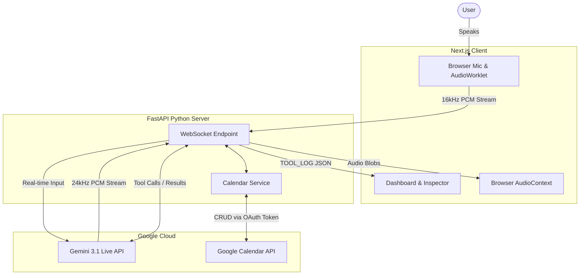

# CalendyAI

A voice-first meeting scheduling assistant powered by **Gemini 3.1 Flash Multimodal Live API**, integrating directly with Google Calendar. CalendyAI allows users to manage their entire schedule through low-latency, natural language voice streaming, removing the friction of manual calendar interactions.

The application combines hands-free real-time audio streaming, an interactive **Agent Tool Telemetry Inspector**, and a high-contrast design system.

---

## Table of Contents

- [Features](#features)
- [Architecture](#architecture)
- [Local Development Setup](#local-development-setup)
- [Agent Tool Telemetry Inspector](#agent-tool-telemetry-inspector)
- [Technologies](#technologies)

---

## Features

- **Gemini Multimodal Live API** — Powered by `gemini-3.1-flash-live-preview` for ultra-fast, bidirectional audio streaming and function calling.
- **Real-Time Voice Streaming** — The Next.js frontend captures 16kHz PCM audio via an `AudioWorklet` and streams it directly to a Python FastAPI backend over WebSockets, bypassing traditional STT/TTS latency delays.
- **Agent Tool Telemetry Inspector** — Live developer console window displaying real-time agent stages (`STANDBY`, `LISTENING`, `SPEAKING`, `EXECUTING_TOOL`) and logs for all function calls.
- **Full Calendar CRUD** — Create, read, update, and delete Google Calendar events through natural conversation.
- **Auto-Reconnecting WebSockets** — The Python backend maintains a resilient loop, automatically spinning up a new Gemini Live session if the connection times out, providing an uninterrupted user experience.
- **Dynamic Google Calendar Embed** — The frontend automatically refreshes the embedded Google Calendar widget whenever a mutating tool (create, update, delete) is executed.

---

## Architecture

The system has been heavily upgraded to use a hybrid Next.js + FastAPI architecture, maximizing the capabilities of the Gemini Multimodal Live API.

```text
calendyai/
├── app/
│   ├── api/auth/          # NextAuth.js Google OAuth handler (for Calendar scopes)
│   ├── login/             # Login page
│   ├── page.tsx           # Main dashboard (calendar iframe + Agent Inspector + Voice Dock)
│   ├── globals.css        # Global styles
├── backend/
│   ├── main.py                    # FastAPI entry point
│   ├── services/
│   │   ├── gemini_live_service.py # Gemini Live API WebSocket handler & auto-reconnect loop
│   │   ├── calendar_service.py    # Google Calendar CRUD Python service
│   │   └── ai_service.py          # System instructions & fallback handlers
├── public/
│   └── pcm_processor.js   # Client-side AudioWorklet for raw 16kHz PCM capturing
```

### System Flow & WebSockets

1. **Audio Capture**: The browser uses `getUserMedia` and an `AudioWorkletNode` (`pcm_processor.js`) to capture raw PCM audio at 16kHz.
2. **Client-Server WebSocket**: The audio is streamed via WebSocket to the FastAPI backend (`ws://localhost:8000/ws/live`).
3. **Gemini Live Connection**: FastAPI connects to the Gemini Multimodal Live API via the `google-genai` SDK and forwards the client's PCM audio in real-time.
4. **Native Tool Calling**: When Gemini decides to interact with the calendar, it sends a `tool_call` request to FastAPI. FastAPI executes the Python `calendar_service` logic and returns the result to Gemini, while simultaneously emitting a `TOOL_LOG` payload to the Next.js frontend for telemetry and UI updates.
5. **Audio Playback**: Gemini streams 24kHz PCM audio back through FastAPI to the browser, which plays it seamlessly via an `AudioContext`.



---

## Local Development Setup

### Prerequisites

- **Node.js** 18+ and npm
- **Python** 3.9+
- A **Google Cloud** project with the Google Calendar API enabled.
- **OAuth 2.0 credentials** configured in Google Cloud Console.
- A **Gemini API key** from [Google AI Studio](https://aistudio.google.com/) (Must be a billing-enabled key or project to use the Live API).

### 1. Clone the Repository

```bash
git clone https://github.com/sukronz/calendyai.git
cd calendyai
```

### 2. Configure Environment Variables

Create a `.env.local` file in the project root:

```env
GOOGLE_CLIENT_ID=your_google_oauth_client_id
GOOGLE_CLIENT_SECRET=your_google_oauth_client_secret
GEMINI_API_KEY=your_gemini_api_key
NEXTAUTH_SECRET=any_random_secret_string
NEXTAUTH_URL=http://localhost:3000
```

### 3. Start the Next.js Frontend

```bash
npm install
npm run dev
```

### 4. Start the FastAPI Backend

In a new terminal window:

```bash
cd backend
python -m venv venv
source venv/bin/activate  # On Windows use `venv\Scripts\activate`
pip install -r requirements.txt
uvicorn main:app --reload --port 8000
```

The application frontend will be available at `http://localhost:3000`.

---

## Agent Tool Telemetry Inspector

The dashboard includes a live **Agent Tool & Telemetry Inspector** terminal window that logs WebSocket traffic and events:

| Tool Name | Action Description | Purpose |
|---|---|---|
| `list_events` | 🔍 to find events | Queries Google Calendar for events within a time window to detect overlaps. |
| `create_event` | 📅 to create an event | Creates a new calendar event with start/end time and summary. |
| `update_event` | ✏️ to update an event | Patches an existing event by ID (time shift, title change). |
| `delete_event` | 🗑️ to delete an event | Permanently removes an event by ID. |

*(Note: Creating, updating, or deleting an event automatically triggers the Google Calendar iframe to refresh.)*

---

## Technologies

| Layer | Technology | Purpose |
|---|---|---|
| **Frontend Framework** | Next.js 15 | React framework, UI dashboard, and Google Auth |
| **Backend Framework** | FastAPI (Python) | High-performance WebSocket proxy for Gemini Live API |
| **Authentication** | NextAuth.js (Google Provider) | OAuth 2.0 login with Google Calendar scopes |
| **LLM** | Gemini Multimodal Live API | Low-latency streaming voice and tool interactions |
| **Audio Processing** | AudioWorklet / Web Audio API | In-browser 16kHz capture and 24kHz playback |
| **Styling** | Tailwind CSS | Utility-first CSS framework |
