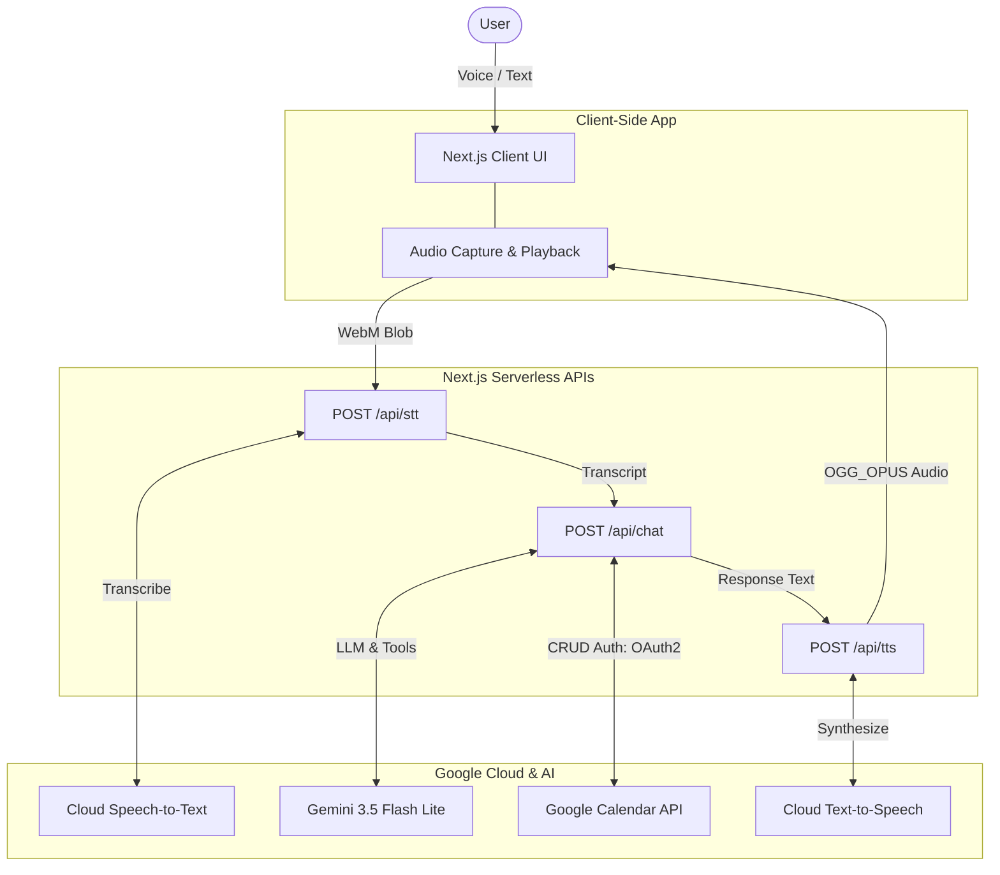
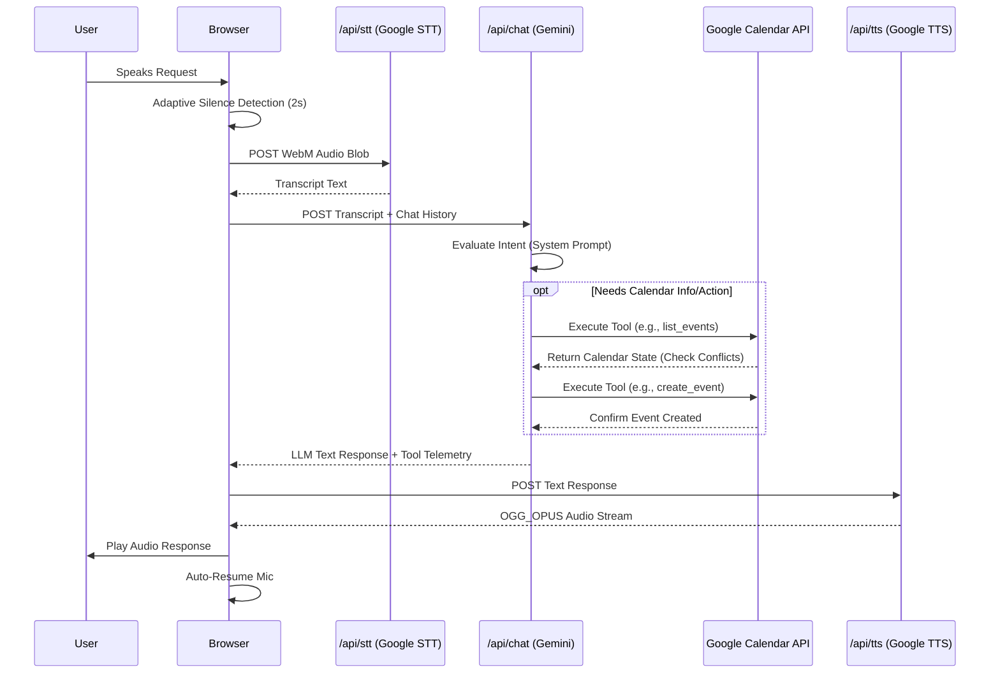

# CalendyAI

A voice-first meeting scheduling assistant powered by **Gemini 3.5 Flash Lite** and Google Cloud AI services, integrating directly with Google Calendar. CalendyAI allows users to manage their entire schedule through natural language voice commands, removing the friction of manual calendar interactions.

The application combines hands-free voice automation, an interactive **Agent Tool Telemetry Inspector**, and a high-contrast design system.

---

## Table of Contents

- [Features](#features)
- [GCP Cloud Run Deployment](#gcp-cloud-run-deployment)
- [Local Development Setup](#local-development-setup)
- [Architecture](#architecture)
- [Technologies](#technologies)
- [Agent Tool Telemetry Inspector](#agent-tool-telemetry-inspector)
- [Design Decisions](#design-decisions)

---

## Features

- **Gemini 3.5 Flash Lite Intelligence** — Powered by `gemini-3.5-flash-lite` for ultra-fast, tool-calling natural language scheduling.
- **Voice-First Interaction** — Tap the microphone, speak your request, and the assistant handles the rest. Supports continuous hands-free operation with hybrid silence detection and auto-resume after each response.
- **Agent Tool Telemetry Inspector** — Claude Code-style live developer console window displaying real-time agent stages (`STANDBY`, `RECORDING_STT`, `THINKING_LLM`, `EXECUTING_TOOL`, `SYNTHESIZING_TTS`) and full JSON payload logs for all function calls.
- **Full Calendar CRUD** — Create, read, update, and delete Google Calendar events through natural conversation.
- **Accurate Conflict Resolution** — Automatically checks for scheduling conflicts using `list_events` and calculates the next earliest truly free time slot outside existing event boundaries.
- **Text-to-Speech Responses** — Every AI response is synthesized into low-latency `OGG_OPUS` audio using Google Cloud TTS, accompanied by a synchronized waveform visualizer.
- **Google Cloud Run Ready** — Includes a multi-stage `Dockerfile`, `.dockerignore`, and 1-command deployment script to Google Cloud Run.

---

## GCP Cloud Run Deployment

CalendyAI is pre-configured for instant deployment to Google Cloud Run.

### 1. Build and Deploy from CLI

Ensure the `gcloud` CLI is logged in and set to your GCP project:

```bash
gcloud services enable run.googleapis.com artifactregistry.googleapis.com cloudbuild.googleapis.com

gcloud run deploy calendy \
  --source . \
  --region us-central1 \
  --allow-unauthenticated \
  --set-env-vars "GOOGLE_CLIENT_ID=your_id,GOOGLE_CLIENT_SECRET=your_secret,NEXTAUTH_SECRET=your_secret,GEMINI_API_KEY=your_gemini_key,GOOGLE_API_KEY=your_google_key"
```

### 2. Configure OAuth Redirect URI

In [Google Cloud Console Credentials](https://console.cloud.google.com/apis/credentials), add your Cloud Run URL under **Authorized redirect URIs**:
```text
https://calendy-166658098413.us-central1.run.app/api/auth/callback/google
```

---

## Local Development Setup

### Prerequisites

- **Node.js** 18+ and npm
- A **Google Cloud** project with APIs enabled:
  - Google Calendar API
  - Google Cloud Text-to-Speech API
  - Google Cloud Speech-to-Text API
- **OAuth 2.0 credentials** (Client ID and Client Secret) configured in Google Cloud Console with `http://localhost:3000/api/auth/callback/google` as an authorized redirect URI.
- A **Gemini API key** from [Google AI Studio](https://aistudio.google.com/).

### 1. Clone the Repository

```bash
git clone https://github.com/sukronz/calendyai.git
cd calendyai
```

### 2. Install Dependencies

```bash
npm install
```

### 3. Configure Environment Variables

Create a `.env.local` file in the project root:

```env
GOOGLE_CLIENT_ID=your_google_oauth_client_id
GOOGLE_CLIENT_SECRET=your_google_oauth_client_secret
GEMINI_API_KEY=your_gemini_api_key
GOOGLE_API_KEY=your_google_api_key
NEXTAUTH_SECRET=any_random_secret_string
NEXTAUTH_URL=http://localhost:3000
```

### 4. Run the Development Server

```bash
npm run dev
```

The application will be available at `http://localhost:3000`.

---

## Architecture

```
calendyai/
├── app/
│   ├── api/
│   │   ├── auth/[...nextauth]/   # NextAuth.js Google OAuth handler
│   │   ├── chat/                  # Gemini 3.5 Flash Lite LLM + function calling route
│   │   ├── stt/                   # Google Cloud Speech-to-Text proxy
│   │   ├── tts/                   # Google Cloud Text-to-Speech proxy (OGG_OPUS)
│   │   └── events/                # Direct calendar event CRUD endpoint
│   ├── login/                     # Login page
│   ├── page.tsx                   # Main dashboard (compact calendar + Agent Inspector + voice dock)
│   ├── layout.tsx                 # Root layout
│   ├── providers.tsx              # NextAuth SessionProvider wrapper
│   └── globals.css                # Global styles, tokens, and animations
├── lib/
│   ├── authOptions.ts             # NextAuth configuration (Google OAuth + Calendar scope)
│   └── calendar.ts                # Google Calendar API client (list, create, update, delete)
├── Dockerfile                     # Multi-stage production container build
├── next.config.ts                 # Next.js config (standalone output enabled)
└── package.json
```

### System Overview



### Voice Pipeline Request Flow



---

## Agent Tool Telemetry Inspector

The dashboard includes a Claude Code-style **Agent Tool & Telemetry Inspector** terminal window:

| Tool Name | Action Description | Purpose |
|---|---|---|
| `list_events` | 🔍 Checking Schedule & Conflict Detection | Queries Google Calendar for events within a time window to detect overlaps. |
| `create_event` | 📅 Booking New Calendar Event | Creates a new calendar event with start/end time and summary. |
| `update_event` | ✏️ Updating Existing Calendar Event | Patches an existing event by ID (time shift, title change). |
| `delete_event` | 🗑️ Deleting Calendar Event | Permanently removes an event by ID. |

---

## Technologies

| Layer | Technology | Purpose |
|---|---|---|
| **Framework** | Next.js 16 (App Router, Turbopack) | Full-stack React framework with serverless API routes |
| **Language** | TypeScript | Type safety across client and server code |
| **Authentication** | NextAuth.js v4 (Google Provider) | OAuth 2.0 login with Google Calendar scope |
| **LLM** | Google Gemini 3.5 Flash Lite (`gemini-3.5-flash-lite`) | Natural language understanding and tool calling |
| **Calendar** | Google Calendar API v3 (`googleapis`) | CRUD operations on user calendar events |
| **Speech-to-Text** | Google Cloud Speech-to-Text v1 | Transcribes audio blobs to text |
| **Text-to-Speech** | Google Cloud Text-to-Speech (OGG_OPUS) | Synthesizes response text into spoken audio |
| **Styling** | Tailwind CSS v4 | Utility-first CSS |
| **Containerization** | Docker + Google Cloud Run | Serverless production deployment |
| **Silence Detection** | Adaptive RMS AudioContext | Dynamic ambient noise calibration for pause detection |

---

## Design Decisions & How the Agent Works

### 1. The Agent's Logic (How it Works)
The core of CalendyAI is an autonomous agent powered by Gemini 3.5 Flash Lite. Unlike simple chatbots, this agent operates in a loop of observation and action:
- **Mandatory Conflict Checking**: The agent is explicitly instructed via its system prompt to always use the `list_events` tool before attempting to book a meeting. This ensures it maps out your day accurately.
- **Advanced Conflict Resolution**: If a requested slot is occupied, the agent doesn't fail or blindly book. It calculates the next earliest free slot outside existing event boundaries and dynamically pivots to suggest an alternative time (e.g., "Tuesday is full, how about Wednesday at 10 AM?").
- **Smarter Time Parsing**: The agent contextually maps relative requests like "sometime late next week" or "an hour before my 5 PM meeting" into precise ISO-8601 datetimes.
- **Adaptive Voice Detection**: Rather than relying on rigid decibel thresholds, the app calibrates to your room's ambient noise floor during the first 500ms of recording. It then sets a dynamic threshold, ensuring background noise (like fans or AC) doesn't interrupt the silence-detection auto-stop.

